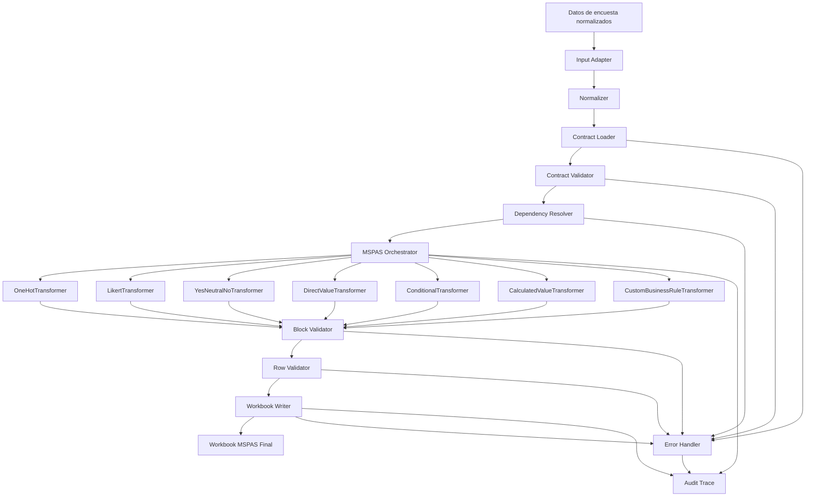

# FASE MSPAS-02 - Congelamiento Oficial de Arquitectura MSPAS Engine v1

Estado: APROBACION DE ARQUITECTURA (sin implementacion funcional)
Fecha: 2026-07-27

## 1) Arquitectura definitiva propuesta

El MSPAS Engine v1 se congela con arquitectura basada en bloques funcionales, no en columnas.

Principios oficiales:
- El motor no conoce preguntas especificas ni columnas individuales como logica de negocio.
- El motor ejecuta contratos de bloque y transformadores genericos.
- El resultado de 170 columnas A..FN emerge de contratos + transformadores + writer.
- El motor es agnostico a UI, ORM y base de datos.
- Politica de one-hot oficial: seleccionado=1, no seleccionado=vacio.
- Columnas imposibles hoy: se mantienen vacias (sin inferencias ni datos inventados).

## 2) Diseño completo del nucleo del motor

Nucleo v1 (capas):
- Input Layer: recibe datos de encuesta ya normalizables (JSON neutral).
- Contract Layer: carga, valida, ordena y resuelve contratos por bloque.
- Transformation Layer: ejecuta transformadores genericos por tipo.
- Validation Layer: valida pre, intra y post transformacion.
- Writing Layer: aplica asignaciones a workbook plantilla.
- Observability Layer: trazas, warnings, errores recuperables y criticos.

Interfaces nucleares:
- runEngine(inputRows, engineConfig) -> { workbook, trace, warnings, errors }
- runBlock(blockContract, normalizedRow, context) -> { assignments, diagnostics }
- writeAssignments(workbook, rowIndex, assignments, writePolicy) -> void

## 3) Diseño del Contract Loader

Responsabilidades:
- Cargar contratos de bloque desde carpeta de contratos.
- Validar schema minimo de contrato.
- Validar version del contrato y compatibilidad con version del engine.
- Resolver dependencias entre bloques (topological order).
- Rechazar contratos invalidos con error tipado.

Entradas:
- contractsPath
- engineVersion
- contractSchemaVersion

Salidas:
- orderedContracts[]
- dependencyGraph
- loaderDiagnostics

Validaciones minimas del loader:
- blockName obligatorio y unico.
- sourceQuestion obligatoria.
- transformerType permitido.
- targetColumns no vacias y sin duplicados globales.
- validValues/catalog definidos cuando aplica.
- fallbacks y defaultValues consistentes.
- reglas condicionales referencian bloques/campos existentes.

## 4) Diseño del Orchestrator

Responsabilidades:
- Coordinar ejecucion de contratos por fila de entrada.
- Invocar normalizacion previa a cada bloque.
- Resolver transformer por tipo declarado en contrato.
- Encadenar validaciones por etapa.
- Consolidar assignments por fila y pasarlos al writer.

Ciclo por fila:
1. Normalizar entrada.
2. Iterar contratos ordenados.
3. Ejecutar transformer generico.
4. Ejecutar validaciones del bloque.
5. Acumular assignments.
6. Ejecutar validaciones de fila completa.
7. Enviar al writer.

Politicas del orchestrator:
- fail-fast configurable para errores criticos.
- modo tolerant para warnings recuperables.
- nunca inyectar reglas hardcodeadas fuera de contrato.

## 5) Diseño del Workbook Writer

Responsabilidades:
- Cargar plantilla MSPAS.
- Resolver hoja destino y layout fijo.
- Escribir columnas A..FN en fila destino.
- Preservar filas estructurales y formulas de plantilla.
- Aplicar politica de vacio/1 en one-hot.

Reglas del writer:
- No altera filas de estructura 1..4.
- Inicia datos en fila definida por contrato global.
- Escribe solo columnas definidas por assignments validados.
- No inventa valores para columnas sin dato.
- Mantiene vacio en no seleccionado salvo excepcion contractual documentada.

## 6) Diseño del sistema de Transformadores

Transformadores oficiales v1:
- OneHotTransformer
- LikertTransformer
- YesNeutralNoTransformer
- DirectValueTransformer
- ConditionalTransformer
- CalculatedValueTransformer
- CustomBusinessRuleTransformer (solo excepciones justificadas)

Contrato de ejecucion comun:
- input: { row, blockContract, context }
- output: {
  assignments: { [excelColumn]: value },
  status: ok|warning|error,
  diagnostics: []
}

Reglas:
- Ningun transformer debe depender de nombres de preguntas hardcodeados.
- Toda variacion de comportamiento se expresa en contrato.

## 7) Diseño del sistema de Validaciones

Niveles de validacion:
- Contract validations (carga): schema, versiones, dependencias, columnas duplicadas.
- Input validations (pre-run): tipos, nulos, estructura minima.
- Block validations (runtime): catalogos, one-hot consistency, condiciones, fallback.
- Row validations (post-block): cobertura obligatoria, formulas calculables, conflictos.
- Workbook validations (post-write): hoja/celdas destino, consistencia A..FN.

Casos a validar explicitamente:
- contratos invalidos
- catalogos invalidos
- bloques incompletos
- valores no soportados
- dependencias no satisfechas
- inconsistencias one-hot
- celdas calculadas

## 8) Diseño del sistema de Normalizacion

Normalizacion comun v1:
- trim
- lowercase/uppercase canonico
- remocion de diacriticos
- normalizacion de apostrofes y caracteres especiales
- colapso de espacios
- equivalencias ortograficas por catalogo

Salidas de normalizacion:
- normalizedValue
- normalizationTrace (opcional para auditoria)

## 9) Diseño del sistema de manejo de errores

Categorias:
- Warning: recuperable, continua ejecucion.
- RecoverableError: aplica fallback y continua.
- CriticalError: detiene fila o corrida segun politica.

Formato de error estandar:
- code
- severity
- block
- sourceField
- targetColumns
- message
- suggestedAction
- fallbackApplied

Politicas:
- errores de contrato: criticos
- valor desconocido con fallback definido: warning/recoverable
- valor desconocido sin fallback: critical/recoverable segun bloque

## 10) Diagrama completo de interacción entre componentes



## 11) Estructura de carpetas recomendada

```text
backend/report-engine/mspas/
  engine/
    index.js
    orchestrator.js
    context.js
  contracts/
    _schema/
      block.contract.schema.json
      global.contract.schema.json
    blocks/
      idioma_predominante.contract.js
      origen_etnico.contract.js
      sexo.contract.js
      servicio_donde_fue_atendido.contract.js
      ...
    global/
      workbook.contract.js
  transformers/
    OneHotTransformer.js
    LikertTransformer.js
    YesNeutralNoTransformer.js
    DirectValueTransformer.js
    ConditionalTransformer.js
    CalculatedValueTransformer.js
    CustomBusinessRuleTransformer.js
  validators/
    contractValidator.js
    catalogValidator.js
    blockValidator.js
    rowValidator.js
    workbookValidator.js
  normalizers/
    textNormalizer.js
    catalogNormalizer.js
  writer/
    workbookWriter.js
    cellResolver.js
    sheetResolver.js
  catalogs/
    idiomas.js
    origenEtnico.js
    sexo.js
    servicio.js
    likert.js
    recomendacion.js
  errors/
    EngineError.js
    errorCodes.js
    errorHandler.js
  trace/
    auditTrace.js
  tests/
    unit/
    integration/
    golden/
```

## 12) Flujo completo oficial

Datos de encuesta
-> Normalizacion
-> Carga de contratos
-> Transformadores genericos
-> Validaciones
-> Writer
-> Workbook MSPAS final

Reglas del flujo:
- Sin acoplamiento a React/Sequelize/PostgreSQL.
- Sin reglas de bloque hardcodeadas fuera de contratos.
- Sin poblar columnas imposibles con valores inventados.

## 13) Porcentaje estimado del trabajo restante

Base tecnica usada:
- Reutilizacion estimada del estado actual: 35.71%.

Estimacion de trabajo restante para MSPAS Engine v1:
- Total restante aproximado: 64.29%.

Desglose orientativo de restante:
- Nucleo generico (loader/orchestrator/writer/validators/errors): 40%
- Contratos por bloque (35 contratos, formalizacion completa): 35%
- Pruebas integracion + golden file: 15%
- Hardening operativo/documentacion final: 10%

Nota:
- Esta estimacion excluye cierre de brechas de datos imposibles actuales (idioma faltante en captura y COEX por periodo), que dependen de decision funcional externa al motor.

## 14) Plan de implementación recomendado por fases

Fase 0 (actual): Congelamiento de arquitectura
- Salida: este documento + inventarios + aprobacion formal.

Fase 1: Nucleo del engine (sin nuevos bloques)
- Contract Loader
- Orchestrator
- Error Handler
- Normalizers
- Validators base
- Workbook Writer base

Fase 2: Transformadores genericos v1
- OneHot
- Likert
- YesNeutralNo
- DirectValue
- Conditional
- CalculatedValue
- CustomBusinessRule (solo si evidencia lo exige)

Fase 3: Migracion de logica existente al esquema contractual
- Reemplazar pipelines especificos por ejecucion generica por contrato.
- Mantener parity funcional con pruebas.

Fase 4: Contratos de bloques y validacion integral
- Registrar contratos por bloque.
- Ejecutar pruebas unitarias e integracion por bloque.
- Ejecutar golden-file contra plantilla.

Fase 5: Certificacion v1
- Auditoria final de trazabilidad.
- Informe de riesgos residuales.
- Aprobacion para iniciar implementacion funcional de bloques pendientes.

---

## Decisión oficial registrada

Se congela oficialmente la arquitectura MSPAS Engine v1 bajo enfoque por bloques funcionales y transformadores genericos.

No se autoriza continuar con implementacion columna-a-columna ni con nuevos mapeos especificos hasta completar el nucleo del motor segun este diseño.
